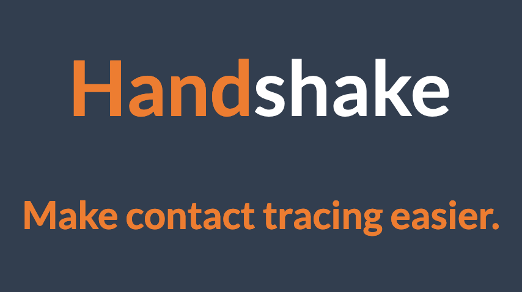

This is a simple tool that helps make it easy to send a quick email to the person or business you meet so that you both have a record of meeting (in your own email accounts).

You're just sending an email to the person you meet, no data is centrally stored by Handshake at all when you use this approach.
